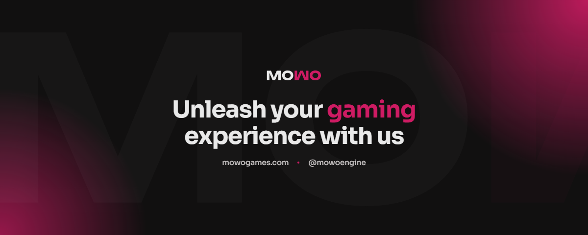

<!--
  Mowo Group — GitHub Organization Profile
  Place this file at: github.com/mowo-group/.github/profile/README.md
-->

<!-- BANNER (replace ./banner.png once it's ready) -->

  

<h1 align="center">Mowo Games</h1>

  <b>Studios, products, and the technology that powers them — all under one roof.</b> 
  Parent company behind <a href="https://mowoengine.com">MowoEngine</a>. Est. 2026.

  
  
  
  
  

 

  
  
  
  
  
  
  
  
  
  
  
  
  

 

## Get in touch

  <a href="https://mowo.group">🌐 mowo.group</a> &nbsp;·&nbsp;
  <a href="https://mowogames.com">🎮 mowogames.com</a> &nbsp;·&nbsp;
  <a href="https://twitter.com/mowogroup">🐦 @mowogroup</a> &nbsp;·&nbsp;
  <a href="https://mowo.group/contact">✉ contact</a>

 

  © 2025–present <b>Mowo Group</b>. Built by people who ship.

